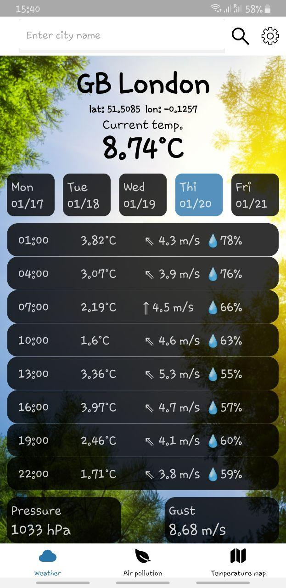
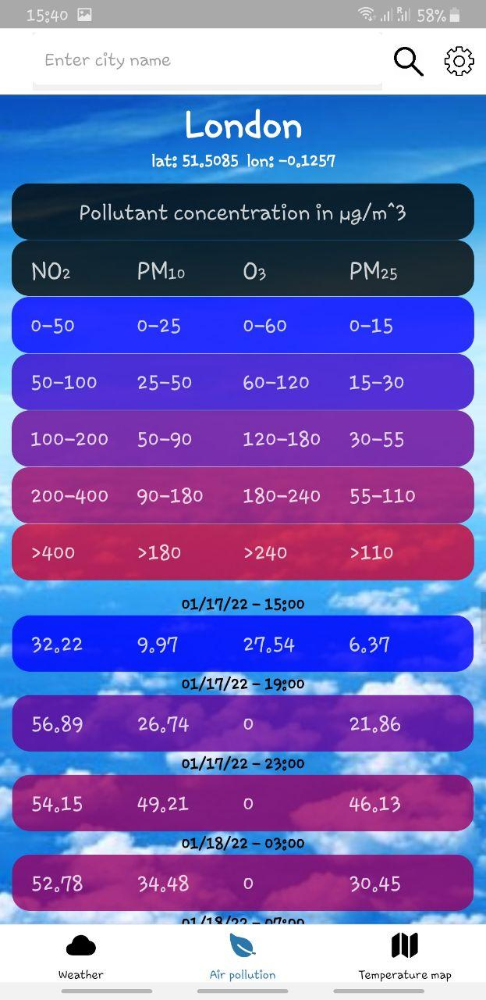

# Weather

### Description
Weather is a hybrid BE/FE application designed to provide weather-related data and services. This project leverages external APIs to gather real-time weather information and offers endpoints for clients to access various weather metrics. The system is built with a focus on scalability and reliability, ensuring efficient handling of API requests.

### Key Features:

#### 1. Weather Data Integration:
- Fetches real-time weather data using third-party APIs.
- Provides detailed weather metrics such as temperature, humidity, and wind speed.

#### 2. Customizable Querying:
- Allows users to tailor requests to specific data needs (e.g., current weather, forecasts).

#### 3. Scalability and Performance:
- Built with a robust backend architecture to handle concurrent requests efficiently.

### Technology Stack:

- **API Integration:** External weather service APIs (e.g., OpenWeather, WeatherStack).

This project demonstrates expertise in frontend development, API integration, and designing services for real-time data handling. It can serve as a foundation for weather-related applications or services.

### Photos

  
  
  
  

